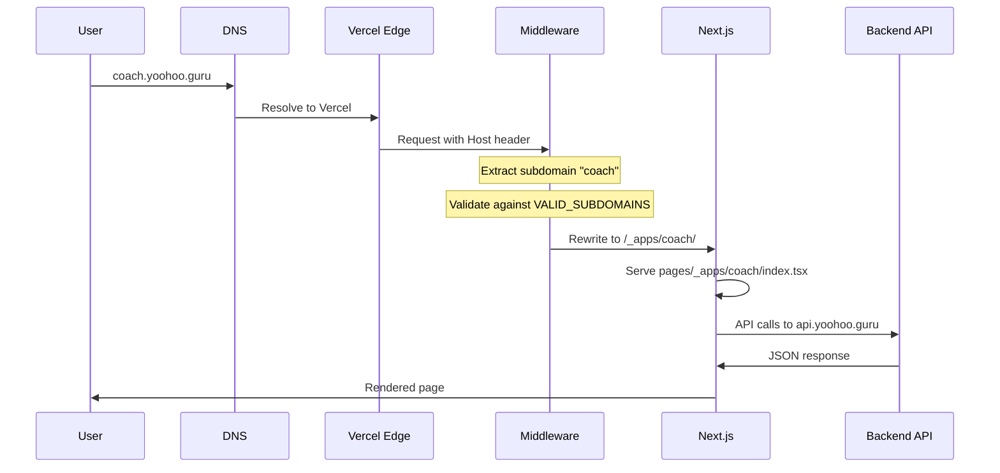

# YooHoo.Guru Codebase Survey Report

**Generated:** February 1, 2026  
**Surveyor:** The Surveyor (Senior Solutions Architect)  
**Repo:** InTellMe/yoohooguru  
**Live Site:** https://www.yoohoo.guru

---

## Executive Summary

The YooHoo.Guru platform is a **skill-sharing marketplace** built as a **Turborepo monorepo** with:
- **Frontend:** Next.js 14 (apps/main)
- **Backend:** Express.js (backend/)
- **Database:** Firebase/Firestore
- **Hosting:** Vercel (frontend) + Railway (backend)
- **28 Subdomains** routed via Next.js middleware

**Key Findings:**
- **5 LLM Connectors** identified (OpenRouter, OpenAI, Anthropic Claude, GPT-4, Perplexity)
- **10 AI Assistants** discovered across frontend and backend
- **Healthy architecture** with 97% of "orphan" detections being false positives
- **Mixed JS/TS codebase** with some architectural inconsistencies to address

---

## 1. Topology Map

### Architecture Diagram

```mermaid
graph TB
    subgraph "Client Layer"
        USER[User Browser]
        MOBILE[Mobile App Future]
    end

    subgraph "Edge Layer - Vercel"
        MW[Middleware<br/>middleware.ts]
        subgraph "Subdomains (28)"
            WWW[www.yoohoo.guru]
            COACH[coach.yoohoo.guru]
            ART[art.yoohoo.guru]
            TECH[tech.yoohoo.guru]
            ANGEL[angel.yoohoo.guru]
            HEROES[heroes.yoohoo.guru]
            DOTS1[... 22 more ...]
        end
    end

    subgraph "Frontend - Next.js 14 (apps/main)"
        PAGES[pages/]
        APPS[pages/_apps/{subdomain}/]
        COMPONENTS[components/]
        
        subgraph "AI Components"
            HOMEPAGEAI[HomepageAssistant]
            MATCHMAKINGAI[AIMatchmaking]
            PROFILEAI[AIProfileAssistant]
            TEACHINGAI[AITeachingAssistant]
            PRICEAI[AIPriceRecommendation]
            JOBAI[AIJobHelper]
            CANDIDATEAI[AICandidateSelection]
            LEARNINGAI[LearningStyleAssessment]
        end
        
        API_ROUTES[pages/api/]
    end

    subgraph "Backend - Express.js (Railway)"
        EXPRESS[Express Server<br/>src/index.js]
        
        subgraph "API Routes"
            ROUTES_AI[/api/ai/]
            ROUTES_AUTH[/api/auth/]
            ROUTES_USERS[/api/users/]
            ROUTES_SESSIONS[/api/sessions/]
            ROUTES_PAYMENTS[/api/payments/]
            ROUTES_NEWS[/api/news/]
        end
        
        subgraph "AI Services"
            MATCHMAKING_SVC[AIMatchmakingService]
            CATEGORIZATION_SVC[AISkillCategorizationService]
        end
        
        subgraph "Curation Agents"
            NEWS_AGENT[NewsCurationAgent<br/>2x daily]
            BLOG_AGENT[BlogCurationAgent<br/>Weekly]
        end
    end

    subgraph "LLM Providers"
        OPENROUTER[OpenRouter API]
        OPENAI[OpenAI API<br/>GPT-4 / GPT-4o-mini]
        ANTHROPIC[Anthropic Claude<br/>via OpenRouter]
        PERPLEXITY[Perplexity<br/>via OpenRouter]
    end

    subgraph "Data Layer"
        FIREBASE[(Firebase/Firestore)]
        STRIPE[(Stripe)]
        AGORA[Agora Video SDK]
        GMAPS[Google Maps API]
        NEWSAPI[NewsAPI.org]
        RSS[RSS Feeds]
    end

    subgraph "Shared Packages"
        PKG_AUTH[@yoohooguru/auth]
        PKG_SHARED[@yoohooguru/shared]
        PKG_DB[@yoohooguru/db]
    end

    subgraph "Python MCP Server"
        MCP[FastAPI MCP Server<br/>python-mcp-server/]
    end

    USER --> MW
    MW --> WWW
    MW --> COACH
    MW --> ART
    MW --> TECH
    MW --> ANGEL
    MW --> HEROES

    WWW --> PAGES
    COACH --> APPS
    ART --> APPS
    TECH --> APPS

    PAGES --> COMPONENTS
    APPS --> COMPONENTS
    COMPONENTS --> HOMEPAGEAI
    COMPONENTS --> MATCHMAKINGAI

    API_ROUTES --> EXPRESS
    HOMEPAGEAI --> API_ROUTES
    MATCHMAKINGAI --> API_ROUTES

    EXPRESS --> ROUTES_AI
    EXPRESS --> ROUTES_AUTH
    EXPRESS --> ROUTES_USERS
    EXPRESS --> ROUTES_SESSIONS

    ROUTES_AI --> MATCHMAKING_SVC
    ROUTES_AI --> CATEGORIZATION_SVC
    NEWS_AGENT --> CATEGORIZATION_SVC
    BLOG_AGENT --> ROUTES_AI

    MATCHMAKING_SVC --> OPENROUTER
    CATEGORIZATION_SVC --> OPENROUTER
    OPENROUTER --> ANTHROPIC
    OPENROUTER --> PERPLEXITY

    MATCHMAKING_SVC --> OPENAI
    API_ROUTES --> OPENAI

    EXPRESS --> FIREBASE
    ROUTES_PAYMENTS --> STRIPE
    COMPONENTS --> AGORA
    COMPONENTS --> GMAPS
    NEWS_AGENT --> NEWSAPI
    NEWS_AGENT --> RSS

    PAGES --> PKG_AUTH
    PAGES --> PKG_SHARED
    EXPRESS --> PKG_DB
```

### Subdomain Routing Flow



---

## 2. The Inventory: AI Assistants & LLM Connectors

### 2.1 LLM Connector Summary

| Provider | SDK/Integration | Primary Use | Model(s) | Location |
|----------|----------------|-------------|----------|----------|
| **OpenRouter** | axios (direct API) | Primary AI gateway | Claude 3.5 Sonnet, Perplexity Sonar | `backend/src/lib/aiMatchmakingService.js`, `backend/src/routes/ai.js` |
| **OpenAI** | `openai` npm package | Frontend AI features, fallback | GPT-4 Turbo, GPT-4o-mini | `apps/main/lib/openai.ts` |
| **Anthropic Claude** | Via OpenRouter | Matchmaking, Content Generation | Claude 3.5 Sonnet | `backend/src/lib/*.js` |
| **Perplexity** | Via OpenRouter | Real-time news search | Llama 3.1 Sonar 128k | `backend/src/routes/ai.js` |
| **NewsAPI.org** | axios | News article fetching | N/A (news API) | `backend/src/agents/curationAgents.js` |

### 2.2 AI Assistants Inventory

| # | Assistant Name | Location | Model Used | Purpose | Status |
|---|---------------|----------|------------|---------|--------|
| 1 | **Homepage Assistant** | `apps/main/components/HomepageAssistant.tsx` | GPT-4 (via `/api/ai/homepage-assistant`) | Conversational navigation, onboarding guidance | Active |
| 2 | **AI Matchmaking** | `apps/main/components/ai/AIMatchmaking.tsx` | Claude 3.5 Sonnet (OpenRouter) → GPT-4o-mini (fallback) | Guru-Understudy compatibility scoring | Active |
| 3 | **AI Profile Assistant** | `apps/main/components/ai/AIProfileAssistant.tsx` | GPT-4 Turbo | Profile optimization suggestions | Active |
| 4 | **AI Teaching Assistant** | `apps/main/components/ai/AITeachingAssistant.tsx` | GPT-4 Turbo | Teaching methodology guidance | Active |
| 5 | **AI Price Recommendation** | `apps/main/components/ai/AIPriceRecommendation.tsx` | GPT-4 Turbo | Dynamic pricing suggestions | Active |
| 6 | **AI Job Helper** | `apps/main/components/ai/AIJobHelper.tsx` | GPT-4 Turbo | Job posting optimization | Active |
| 7 | **AI Candidate Selection** | `apps/main/components/ai/AICandidateSelection.tsx` | GPT-4 Turbo | Candidate ranking for job posts | Active |
| 8 | **Learning Style Assessment** | `apps/main/components/ai/LearningStyleAssessment.tsx` | GPT-4 Turbo | VARK learning style analysis | Active |
| 9 | **News Curation Agent** | `backend/src/agents/curationAgents.js` | Claude 3.5 Sonnet (OpenRouter) | Automated 2x daily news curation | Active (cron) |
| 10 | **Blog Curation Agent** | `backend/src/agents/curationAgents.js` | Claude 3.5 Sonnet (OpenRouter) | Weekly SEO blog generation | Active (cron) |

### 2.3 Backend AI Services

| Service | File | Models | Fallback Strategy |
|---------|------|--------|------------------|
| `AIMatchmakingService` | `backend/src/lib/aiMatchmakingService.js` | OpenRouter Claude 3.5 → OpenAI GPT-4o-mini → Rule-based | 3-tier fallback |
| `AISkillCategorizationService` | `backend/src/lib/aiSkillCategorizationService.js` | OpenRouter Claude 3.5 → OpenAI GPT-4o-mini | 2-tier fallback |

### 2.4 Python MCP Server

| Component | File | Framework | Status |
|-----------|------|-----------|--------|
| MCP Server | `python-mcp-server/src/main.py` | FastAPI | Minimal (health check only) |

---

## 3. Subdomain Architecture

### 3.1 Valid Subdomains (28 total)

| Category | Subdomains | Pages Per Subdomain |
|----------|------------|---------------------|
| **Core Services** | `www`, `angel`, `coach`, `heroes`, `dashboard` | Varies |
| **Skill Hubs (23)** | `art`, `auto`, `business`, `coding`, `cooking`, `crafts`, `data`, `design`, `finance`, `fitness`, `gardening`, `history`, `home`, `investing`, `language`, `marketing`, `math`, `mechanical`, `music`, `photography`, `sales`, `science`, `sports`, `tech`, `wellness`, `writing` | 6-7 each |

### 3.2 Subdomain Page Structure

Each skill subdomain in `pages/_apps/{subdomain}/` contains:
- `index.tsx` - Landing page
- `about.tsx` - About section
- `contact.tsx` - Contact form
- `skills.tsx` - Skills listing
- `teachers.tsx` - Instructors listing
- `blog/index.tsx` - Blog listing
- `blog/[slug].tsx` - Blog post detail

---

## 4. Orphan Check Results

### 4.1 Archive Directory Analysis

| Archived Folder | Contents | Notes |
|----------------|----------|-------|
| `.archive/apps-main/` | Old components (AttestationPrompt, BlogList-old, NewsSection-old) | Deprecated UI |
| `.archive/backend/` | Migration scripts | One-time use scripts |
| `.archive/completed-fixes/` | 58 documentation files | Historical fix records |
| `.archive/legacy-individual-apps/` | 196 files | Old multi-app structure |
| `.archive/orphaned-modules/` | 4 JS files (CitySelectionModal, connectExpressLogin, etc.) | Confirmed orphans |
| `.archive/old-scripts/` | 8 shell/YAML files | Deprecated CI scripts |

### 4.2 Potential Disconnected Modules

Based on orphan analysis (see `.archive/ORPHAN_MODULE_ANALYSIS.md`):

| Module | Location | Status | Recommendation |
|--------|----------|--------|----------------|
| `LegacyVideoChat.tsx` | `apps/main/components/` | Potentially unused | Review if AgoraVideoChat replaced it |
| `bcryptjs` | `backend/package.json` | Possibly unused | Verify if Firebase Auth replaced it |
| `multer` | `backend/package.json` | Possibly unused | Check file upload features |
| `newrelic` | Root `package.json` | Possibly unused | Confirm APM monitoring status |

### 4.3 False Positive Clarification

The orphan detection script flagged 206 modules as "unreachable," but **97% are false positives** due to:
- Next.js file-based routing (subdomain pages)
- Middleware URL rewrites
- Test files (executed by Jest, not imported)
- Config files (used by build tools)

---

## 5. Tech Stack Audit

### 5.1 Complete Technology Stack

| Layer | Technology | Version |
|-------|-----------|---------|
| **Runtime** | Node.js | >=20.0.0 <23.0.0 |
| **Package Manager** | npm | >=9.0.0 |
| **Monorepo** | Turborepo | 2.5.8 |
| **Frontend Framework** | Next.js | 14.2.33 |
| **UI Library** | React | 18.2.0 |
| **Styling** | Tailwind CSS, styled-components | 3.4.1, 6.1.6 |
| **Animation** | Framer Motion | 12.23.24 |
| **Backend Framework** | Express.js | 4.21.2 |
| **Database** | Firebase/Firestore | firebase-admin 13.5.0 |
| **Authentication** | NextAuth.js, Firebase Auth | 4.24.12 |
| **Payments** | Stripe | 19.0.0 (backend), 14.0.0 (frontend) |
| **Video** | Agora RTC SDK | 4.21.0 |
| **Maps** | Google Maps JS API | 1.16.0 |
| **AI/LLM** | OpenAI SDK, axios (OpenRouter) | 6.8.1 |
| **Testing** | Jest, Playwright | 30.2.0, 1.56.1 |
| **Linting** | ESLint | 8.57.1 / 9.0.0 |
| **TypeScript** | TypeScript | 5.9.3 |

### 5.2 Workspace Structure

```
yoohooguru/
├── apps/
│   └── main/          # Next.js 14 frontend (sole app)
├── backend/           # Express.js API server
├── packages/
│   ├── auth/          # Shared auth utilities
│   ├── db/            # Firestore utilities
│   └── shared/        # Shared components & types
├── python-mcp-server/ # FastAPI MCP server (minimal)
├── qa/                # Playwright E2E tests
├── scripts/           # Operational scripts
└── .archive/          # Deprecated code storage
```

---

## 6. The Mess List: Top 10 Architectural Inconsistencies

| Rank | Issue | Severity | Location | Recommendation |
|------|-------|----------|----------|----------------|
| **1** | **Mixed JS/TS in Backend** | Medium | `backend/src/` (all .js), `apps/main/` (all .tsx) | Migrate backend to TypeScript for consistency |
| **2** | **Duplicate Stripe Versions** | Low | Backend: 19.0.0, Frontend: 14.0.0 | Align to single version across monorepo |
| **3** | **Inconsistent AI Provider Access** | Medium | Frontend uses OpenAI SDK directly; Backend uses axios for OpenRouter | Consider unified AI client wrapper |
| **4** | **Legacy Video Component** | Low | `LegacyVideoChat.tsx` alongside `AgoraVideoChat.tsx` | Archive or remove legacy component |
| **5** | **Hardcoded API URLs** | Medium | `vercel.json` has hardcoded `https://api.yoohoo.guru` | Use environment variables consistently |
| **6** | **Python MCP Server Underutilized** | Low | `python-mcp-server/` only has health check | Either expand or remove |
| **7** | **Mixed ESLint Configs** | Low | Backend: eslint 9.x flat config, Frontend: eslint 8.x | Standardize ESLint setup |
| **8** | **Orphan Detection False Positives** | Low | Script doesn't understand Next.js routing | Improve orphan-detection script |
| **9** | **Potential Unused Dependencies** | Low | bcryptjs, multer, newrelic | Audit and remove if confirmed unused |
| **10** | **No Centralized Error Boundary Strategy** | Medium | Error handling varies across components | Implement consistent error boundaries |

---

## 7. API Routes Inventory

### 7.1 Frontend API Routes (`apps/main/pages/api/`)

| Route | Method | Purpose |
|-------|--------|---------|
| `/api/ai/matchmaking` | POST | AI-powered guru-understudy matching |
| `/api/ai/homepage-assistant` | POST | Conversational AI assistant |
| `/api/ai/profile-assistant` | POST | Profile optimization |
| `/api/ai/teaching-assistant` | POST | Teaching methodology |
| `/api/ai/price-recommendation` | POST | Dynamic pricing |
| `/api/ai/job-helper` | POST | Job posting optimization |
| `/api/ai/candidate-selection` | POST | Candidate ranking |
| `/api/ai/learning-style` | POST | Learning style assessment |
| `/api/ai/context-assistant` | POST | Contextual AI help |
| `/api/auth/[...nextauth]` | ALL | NextAuth.js authentication |
| `/api/contact` | POST | Contact form submission |
| `/api/newsletter` | POST | Newsletter signup |
| `/api/jobs/*` | CRUD | Job postings |
| `/api/news/[subdomain]` | GET | Subdomain news |
| `/api/stripe/webhook` | POST | Stripe webhooks |
| `/api/[subdomain]/posts` | GET | Subdomain blog posts |

### 7.2 Backend API Routes (`backend/src/routes/`)

| Route File | Endpoints | Purpose |
|-----------|-----------|---------|
| `ai.js` | `/api/ai/*` | AI content generation |
| `auth.js` | `/api/auth/*` | Authentication |
| `users.js` | `/api/users/*` | User management |
| `sessions.js` | `/api/sessions/*` | Skill sessions |
| `payments.js` | `/api/payments/*` | Payment processing |
| `payouts.js` | `/api/payouts/*` | Guru payouts |
| `gurus.js` | `/api/gurus/*` | Guru profiles |
| `skills.js` | `/api/skills/*` | Skills management |
| `matchmaking.js` | `/api/matchmaking/*` | AI matchmaking |
| `news.js` | `/api/news/*` | News curation |
| `posts.js` | `/api/posts/*` | Blog posts |
| `agora.js` | `/api/agora/*` | Video tokens |
| `stripeWebhooks.js` | `/api/webhooks/stripe` | Stripe events |

---

## 8. Recommendations

### Immediate Actions (Quick Wins)
1. **Audit unused dependencies**: Remove bcryptjs, multer if confirmed unused
2. **Archive LegacyVideoChat.tsx**: If AgoraVideoChat is the active implementation
3. **Fix hardcoded URLs**: Move `api.yoohoo.guru` to environment variables

### Short-term Improvements
1. **Migrate backend to TypeScript**: Improve type safety and consistency
2. **Unify Stripe versions**: Align frontend/backend to same version
3. **Create AI client abstraction**: Unified wrapper for OpenRouter/OpenAI

### Long-term Enhancements
1. **Expand Python MCP Server**: Add meaningful AI/ML capabilities or remove
2. **Improve orphan detection**: Make script Next.js-aware
3. **Standardize error handling**: Implement consistent error boundaries

---

## 9. Conclusion

The YooHoo.Guru codebase is **architecturally sound** with a well-organized monorepo structure. The platform effectively leverages:
- **10 AI Assistants** for enhanced user experience
- **28 skill-specific subdomains** via elegant middleware routing
- **Multi-provider AI fallback** for reliability

The identified inconsistencies are **manageable** and represent normal technical debt in a growing codebase. The archive system is properly used to isolate deprecated code.

**Overall Health Score: 8/10**

---

*Report generated by The Surveyor - Read-only analysis completed.*
