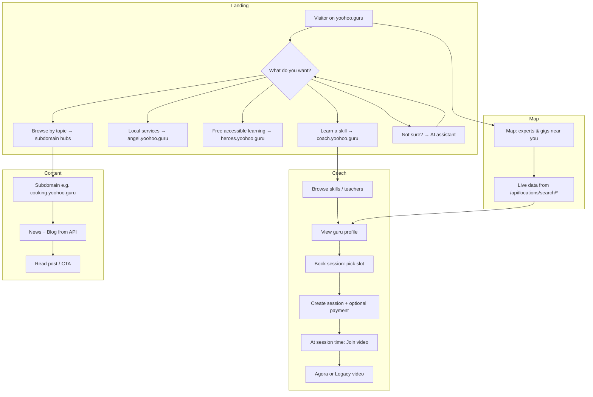

# YooHoo.Guru — Production Readiness Plan

**Document type:** Architecture & execution plan  
**Owner:** @architect  
**Goal:** Bring the site to world-class, production-deployment ready state with clear user flows, connected features, and best-in-show UX.

---

## 1. Executive Summary

The platform has substantial implemented surface (24+ subdomains, backend APIs, AI curation, Stripe, sessions, map UI) but **several features are specified or partially built and not working end-to-end**. Links, content APIs, map data, calendar booking, and video conferencing need to be wired and surfaced so that when a user arrives they can immediately assess what the site does, how it helps them, and how to complete key actions. This plan prioritizes fixes and additions to achieve that.

### Top priorities (high impact, clear gaps)

| Priority | Area | Issue | Action |
|----------|------|--------|--------|
| P0 | First-time clarity | No single “what we do / where to go” above the fold | Add value prop + primary CTAs + AI agent handoff |
| P0 | Blog/subdomain content | Subject pages call wrong APIs; some blog pages use wrong base URL | Fix subject→news/posts API; unify blog base URL |
| P0 | Map | Gurus/gigs use hardcoded sample data; real API exists | Wire MapSection to `/api/locations/search/*` |
| P1 | Calendar & booking | No Calendly-style booking or clear “book a slot” flow | Add calendar availability + booking flow; link to sessions |
| P1 | Video | Agora/Legacy components exist but not in session join flow | Integrate VideoChat into session detail/join page |
| P1 | Navigation & links | Some links go to “coming soon”; subdomain links inconsistent | Audit all nav/footer; fix or replace broken links |
| P2 | AI agent | ContextNavigator exists; not obvious for new users | Make assistant visible on landing; add “Where should I go?” intent |

---

## 2. Current State (Findings)

### 2.1 What’s working

- **Backend:** Auth, gurus (home/posts/news/leads), posts (subdomain + platform), news (subdomain + all), locations (gurus/gigs/all by lat/lng/radius), sessions (create, list, ICS/calendar), Stripe/Connect, admin, AI curation agents.
- **Frontend:** Single Next.js app (`apps/main`), subdomain routing via middleware, homepage with hero/map/services, dashboard, onboarding, profile, browse, subdomain landing pages, blog index/detail per subdomain, ContextNavigator (AI + quick actions), SessionBooking / HeroGuruSessionBooking, AgoraVideo / VideoChat / LegacyVideoChat, SearchableMap / MapSection.
- **Content:** Blog list/detail call `/api/{subdomain}/posts` (posts router); curation agents and Firestore structure per spec.

### 2.2 Gaps and broken behavior

1. **Subject hub page** (`_apps/[subject]/index.tsx`):
   - Calls `GET /api/news?subject=${subject}` — backend has no `subject` query; use `GET /api/news/${subject}` for subject-specific news.
   - Calls `GET /api/blogs?subject=${subject}` — **no `/api/blogs`**; should use `GET /api/${subject}/posts` (posts router) for subject-specific blogs.
   - **Fix:** Use `/api/news/${subject}` and `/api/${subject}/posts` (and ensure `NEXT_PUBLIC_API_URL` is set so requests hit backend).

2. **Subdomain blog index** (e.g. `_apps/cooking/blog/index.tsx`):
   - Uses `apiUrl + '/api/${subdomain}/posts'` — correct for backend (`postsRoutes` mounted at `/api` with `/:subdomain/posts`).
   - **Issue:** Uses `Header` from `@yoohooguru/shared` and internal links like `/_apps/${subdomain}/blog/${slug}`. On real subdomains (e.g. cooking.yoohoo.guru) links should be same-origin (e.g. `/blog`, `/blog/slug`) so middleware already rewrites. Ensure all “back to home” and “blog” links use subdomain-relative paths and that layout matches rest of site (e.g. Navigation/GlobalNav).

3. **Map (gurus/gigs on map):**
   - `MapSection` uses **hardcoded** `SAMPLE_GURUS` and `SAMPLE_GIGS`; comment says “In production, this would be an API call.”
   - Backend already provides:
     - `GET /api/locations/search/gurus?lat=&lng=&radius=`
     - `GET /api/locations/search/gigs?lat=&lng=&radius=`
     - `GET /api/locations/search/all?lat=&lng=&radius=`
   - **Fix:** MapSection (or SearchableMap) must call these with map center/radius and map response to `MapMarker[]`; remove or demote sample data to fallback when API fails.

4. **Calendar booking:**
   - Sessions API supports create, list, ICS export, Google Calendar link (`backend/src/utils/calendar.js`, `backend/src/routes/sessions.js`).
   - No **availability** endpoint (guru’s available slots) and no public “pick a time” flow (Calendly-style).
   - **Gap:** Add availability model + API (e.g. GET/PUT guru availability, GET available slots for a guru) and a booking UI that selects slot then creates session (and optionally payment).

5. **Video conferencing:**
   - Agora token endpoint and frontend components exist (`AgoraVideo.tsx`, `VideoChat.tsx`, `LegacyVideoChat.tsx`; docs in `docs/AGORA_VIDEO_CONFERENCING.md`).
   - **Gap:** Session detail/“Join session” page does not embed VideoChat with session id/channel; join URL is optional on session. **Action:** On session start time, show “Join video” that opens VideoChat (Agora or legacy); ensure backend provides token for channel derived from session id.

6. **Navigation and links:**
   - Footer/GlobalNav reference “Coming Soon” (Help, Contact, Blog, Success Stories, Events, Forum, Mentorship). Either implement minimal versions or replace with “Contact” (e.g. contact form or mailto) and remove or relabel others so nothing is dead.
   - Ensure main hub → Angel’s List / Coach / Hero Gurus use correct subdomain URLs (already https://angel.yoohoo.guru etc. in index).
   - Subdomain pages: consistent header/footer and “Back to hub” / “Dashboard” links.

7. **Blog generation and serving:**
   - Curation agents and Firestore structure are in place; blog list/detail read from Firestore via `/api/:subdomain/posts` and `/api/:subdomain/posts/:slug`.
   - **Serving:** Ensure subdomain blog index uses limit/pagination and tag filter from API; styling is consistent and “neat” (card layout, read time, date, tags). If no posts, show clear “No posts yet” and optional link to main hub or other subdomain.

8. **PRs and prior work (555–566):**
   - PR #565 (CSV export Firestore Timestamp fix) was draft; if not merged, merge and deploy so admin export is reliable.
   - PRs 560–564: seed data, AI categorization, onboarding/profile, admin live data, CSV — ensure backend (e.g. Railway) has been deployed with these and env (OPENROUTER, Firebase, etc.) is set.
   - ContextNavigator (PR 557, 559): already global; make it discoverable on first visit (e.g. “Not sure where to go? Ask the assistant”).

---

## 3. User Flows (Target State)

### 3.1 New visitor (anonymous)

1. Lands on **yoohoo.guru** (or www).
2. **Immediately sees:** One-line value prop (“Share skills, find local experts, learn for free”), three paths (SkillShare / Angel’s List / Hero Gurus) with clear CTAs, and a short “What can I do here?” with optional AI assistant.
3. Can: **Browse experts/gigs on map** (real data), **Explore a path** (e.g. Coach → coach.yoohoo.guru), **Sign up** or **Log in**.
4. If confused: **AI agent** (“Where should I go?”) suggests: “Learn a skill” → coach, “Find or offer a local service” → angel, “Free accessible learning” → heroes, or “Browse by topic” → content hubs.

### 3.2 Wants to learn a skill (Coach)

1. From hub or AI: goes to **coach.yoohoo.guru** (or /browse on main).
2. Browses skills/teachers; can filter by location (map or list).
3. Clicks a guru → profile → **Book a session**.
4. **Booking flow:** Chooses date/time (calendar of available slots), confirms → session created; optional payment (Stripe) if applicable.
5. When session time comes: **Join** → video (Agora) or fallback; session marked in progress/completed.

### 3.3 Wants to offer/find local services (Angel’s List)

1. From hub or AI: goes to **angel.yoohoo.guru**.
2. Browses listings (and map if implemented for Angel jobs); can search by location.
3. Can post a gig or respond to one; contact/book as specified for that product.

### 3.4 Content / topic discovery (subdomains)

1. From hub or subdomain nav: lands on e.g. **cooking.yoohoo.guru**.
2. Sees hero, featured posts, news; **Blog** → list of posts (paginated, tags); post detail with affiliate/CTAs.
3. News and blog are loaded from **correct APIs** (`/api/news/:subdomain`, `/api/:subdomain/posts`); no blank or wrong-content pages.

### 3.5 Hero Gurus (free accessible learning)

1. From hub or AI: goes to **heroes.yoohoo.guru**.
2. Browses opportunities; requests distance session; calendar + video join as in Coach flow where applicable.

---

## 4. Implementation Plan (Phased)

### Phase 1: Clarity and content (P0)

| # | Task | Owner | Details |
|---|------|--------|---------|
| 1.1 | Homepage value prop and primary CTAs | Frontend | Add 1–2 sentence “what we do” and three primary buttons (SkillShare, Angel’s List, Hero Gurus) above the fold; keep “Explore” and “Get Started” consistent. |
| 1.2 | Subject page API fix | Frontend + Backend | Subject page: use `GET /api/news/${subject}` and `GET /api/${subject}/posts` (or `/api/gurus/${subject}/posts` if frontend uses that). Add `subject` query support to `GET /api/news` if you prefer keeping a single “all” endpoint with filter. |
| 1.3 | Blog list/detail consistency | Frontend | Ensure every subdomain blog index uses same API pattern and error/empty state; use site Navigation/GlobalNav; fix “Back to home” to subdomain root. |
| 1.4 | MapSection → live data | Frontend | In MapSection (or SearchableMap), call `/api/locations/search/gurus`, `/api/locations/search/gigs`, or `/api/locations/search/all` with `lat`, `lng`, `radius` from map center/radius; map response to `MapMarker[]`; use sample data only as fallback when API fails or returns empty. |
| 1.5 | Locations API and data | Backend | Ensure users/jobs have `location.lat`, `location.lng` where applicable (onboarding/profile, listing creation); document expected shape so map and search stay in sync. |

### Phase 2: Booking and video (P1)

| # | Task | Owner | Details |
|---|------|--------|---------|
| 2.1 | Calendar availability | Backend | Define availability model (e.g. recurring rules or stored slots per guru); add GET (and optionally PUT) availability, GET available slots for a date range. |
| 2.2 | Booking flow (pick slot) | Frontend | Session booking: show calendar with available slots from new API; on select, create session (existing POST /api/sessions) and redirect to confirmation or payment. |
| 2.3 | Session “Join” and video | Frontend + Backend | On session detail when status is confirmed and within start window: show “Join video”; open VideoChat with channel = f(sessionId); backend provides Agora token for that channel; fallback to LegacyVideoChat if Agora not configured. |
| 2.4 | Agora env and docs | DevOps | Ensure NEXT_PUBLIC_AGORA_APP_ID and backend AGORA_APP_ID/AGORA_APP_CERTIFICATE are documented and set in staging/production so video works. |

### Phase 3: Navigation and AI (P1–P2)

| # | Task | Owner | Details |
|---|------|--------|---------|
| 3.1 | Audit all nav/footer links | Frontend | List every link in GlobalNav, Footer, and subdomain headers; replace broken or “Coming Soon” with working page or mailto/contact; ensure subdomain links use correct hostnames. |
| 3.2 | AI agent visibility | Frontend | On homepage (and optionally subdomain landing), add a clear entry point: “Not sure where to go? Ask the assistant” that opens or focuses ContextNavigator. |
| 3.3 | Route config and intents | Frontend | In routeConfig, ensure “Where should I go?” / “What can I do?” map to the three products and “Browse by topic”; test AI responses for new visitors. |

### Phase 4: Polish and production (P2)

| # | Task | Owner | Details |
|---|------|--------|---------|
| 4.1 | Blog presentation | Frontend | Consistent card layout, read time, dates, tags across subdomains; optional featured image; mobile-friendly. |
| 4.2 | Merge PR #565 | Backend | If not merged: merge CSV export fix; verify admin export. |
| 4.3 | Deployment and env | DevOps | Checklist: Vercel (frontend), Railway (backend), Firebase, Stripe, Agora, OPENROUTER_API_KEY, NEXT_PUBLIC_API_URL; CORS and domain verification. |
| 4.4 | Smoke tests | QA | Critical paths: home → map (real markers), home → subdomain → blog list → post, signup → onboarding, book session → join video (with test Agora). |
| 4.5 | Sitemap and SEO | Frontend | Per docs/SITEMAP.md: ensure sitemap(s) include hub and subdomain routes; validate with search console. |

---

## 5. API and Link Fixes (Quick Reference)

### 5.1 Frontend API usage

| Page / component | Current | Correct |
|------------------|--------|--------|
| Subject hub (`_apps/[subject]/index.tsx`) | `GET /api/news?subject=${subject}` | `GET /api/news/${subject}` |
| Subject hub | `GET /api/blogs?subject=${subject}` | `GET /api/${subject}/posts` (posts router) |
| Subdomain blog index | `GET ${apiUrl}/api/${subdomain}/posts` | Same; ensure `NEXT_PUBLIC_API_URL` points to backend (e.g. https://api.yoohoo.guru) |
| MapSection | Hardcoded SAMPLE_* | `GET /api/locations/search/all?lat=&lng=&radius=` (and map response to markers) |

### 5.2 Backend routes (existing)

- **News:** `GET /api/news/:subdomain`, `GET /api/news` (all).
- **Posts:** `GET /api/:subdomain/posts`, `GET /api/:subdomain/posts/:slug` (postsRoutes at `/api`).
- **Gurus:** `GET /api/gurus/:subdomain/home`, `GET /api/gurus/:subdomain/posts`, `GET /api/gurus/:subdomain/posts/:slug`, `GET /api/gurus/news/:subdomain`.
- **Locations:** `GET /api/locations/search/gurus`, `GET /api/locations/search/gigs`, `GET /api/locations/search/all` (query: lat, lng, radius).
- **Sessions:** `POST /api/sessions`, `GET /api/sessions`, etc.; calendar helpers in `backend/src/utils/calendar.js`.

### 5.3 New backend endpoints (recommended)

- **Availability:** e.g. `GET /api/availability/:userId` (or `:guruId`), `PUT /api/availability` (update slots or rules).
- **Slots:** `GET /api/availability/:userId/slots?from=&to=` returning available time windows for booking.

---

## 6. Success Criteria for “Best in Show”

- **First 10 seconds:** Visitor sees what the platform is and the three main paths (SkillShare, Angel’s List, Hero Gurus) with working links.
- **First click:** No dead “Coming Soon” without an alternative; subdomain and blog links load correct content.
- **Map:** Homepage map shows real gurus and gigs (from locations API) when data exists; otherwise clear empty state.
- **Booking:** User can choose a time slot (from availability) and create a session; when it’s time, “Join” opens video (Agora or fallback).
- **AI agent:** New users can ask “Where should I go?” and get correct navigation to coach/angel/heroes or topic hubs.
- **Blogs:** Subdomain blog lists and posts load from Firestore via existing APIs; layout is consistent and readable.

---

## 7. Old PRs Review (555–566)

| PR | Title | Status | Action |
|----|--------|--------|--------|
| 555 | SSRF slug validation fix | Merged | None |
| 556 | News curation error categorization | Merged | None |
| 557 | ContextNavigator component | Merged | Ensure visible on landing (Phase 3) |
| 558 | Env consolidation | Merged | None |
| 559 | ContextNavigator navigation fixes | Merged | None |
| 560 | Database seed file | Merged | Verify deployed on Railway |
| 561 | Signup role selection, Back/Menu buttons | Merged | None |
| 562 | AI skill categorization | Merged | Verify backend deployed |
| 563 | Onboarding and profile management | Merged | None |
| 564 | Admin live data (replace mocks) | Merged | None |
| 565 | CSV export Firestore Timestamp fix | Draft | **Merge and deploy** (Phase 4) |
| 566 | Railway deployment config fix | Merged | Verify deployment path |

**Takeaway:** Most merged work is in main; ensure Railway has latest backend and env. Merge #565 for reliable admin CSV export.

---

## 8. User flow diagram (target)

---

## 9. References

- **Spec:** `spec/site-spec.md`
- **Site review:** `docs/SITE_REVIEW_AND_STATUS.md`
- **PR summary:** `PR_REVIEW_555-565_SUMMARY.md`, `docs/PRS_555_566_DEPLOYMENT_VERIFICATION.md`
- **Sitemap:** `docs/SITEMAP.md`
- **Video:** `docs/AGORA_VIDEO_CONFERENCING.md`, `docs/HERO_GURUS_SESSIONS.md`
- **Locations:** `backend/src/routes/locations.js`
- **Sessions/calendar:** `backend/src/routes/sessions.js`, `backend/src/utils/calendar.js`

---

*Plan created by @architect. Implement in phases; re-check links and user flows after each phase.*
